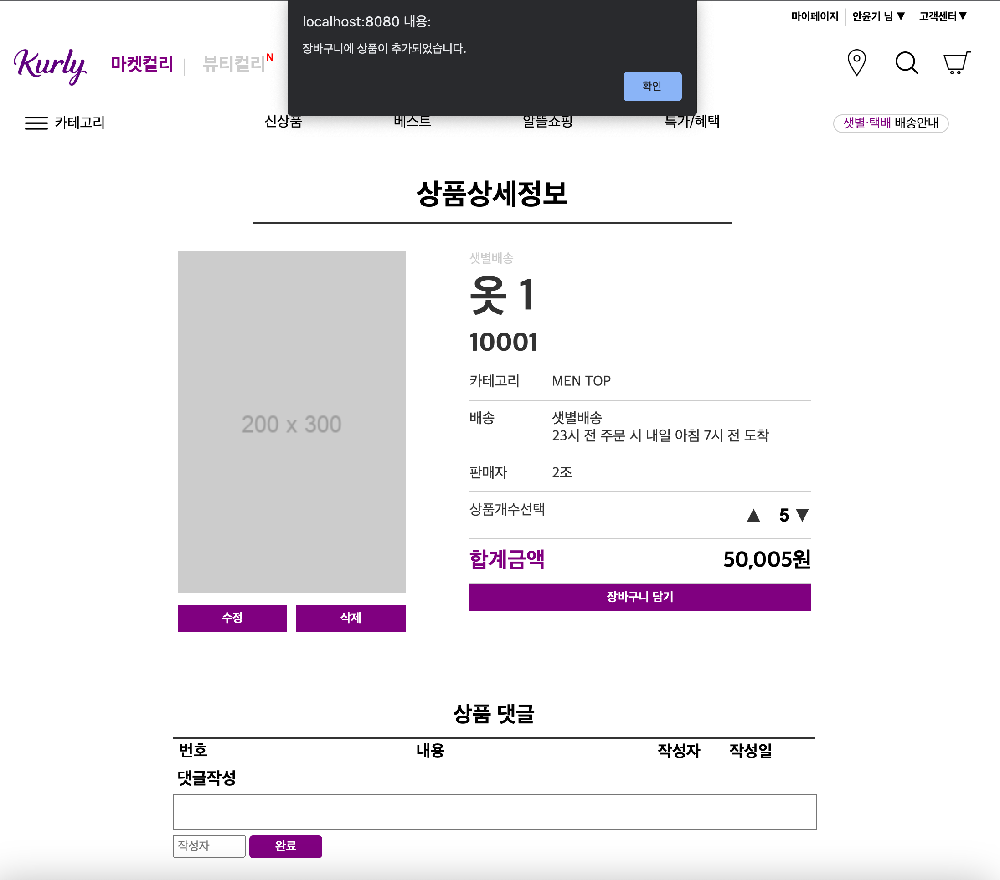
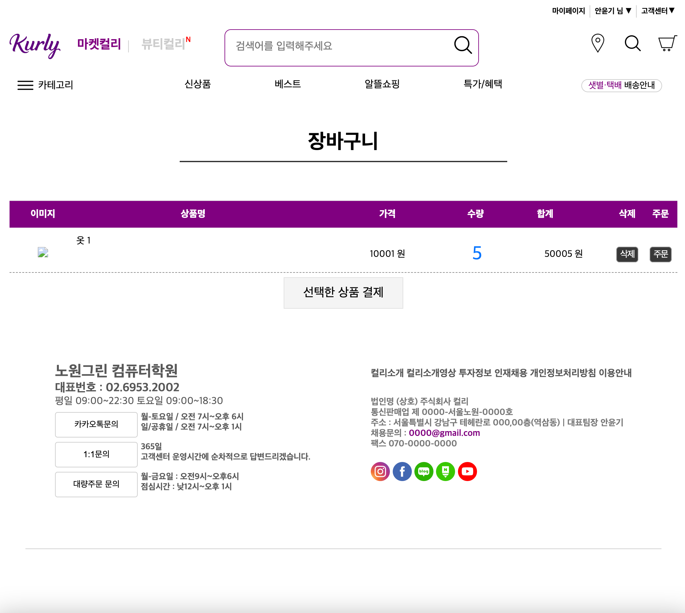
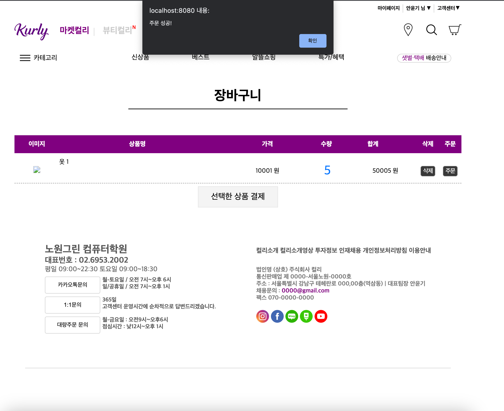
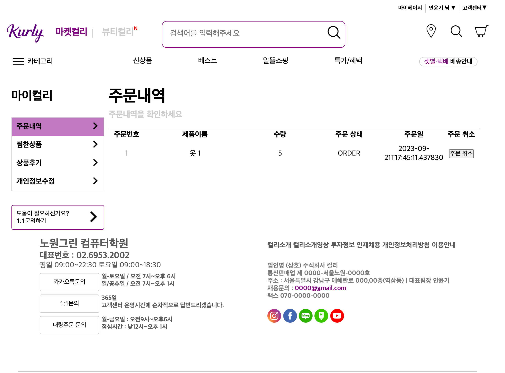

# 쇼핑몰 프로젝트 - 마켓컬리


## 데이터베이스


## Skiis


## 🖥️ 주요기능

### 1) 장바구니 기능
<details>
<summary>장바구니 담기</summary>



>장바구니 담기 Service 로직
```java
 /**
     * 회원 정보와 상품 정보를 받고 그 정보를 바탕으로 장바구니를 생성한다.
     */
    @Transactional
    public void addCart(Long memberId, Long itemId, int count, int price) {
                                                                        // Custom 예외처리 생성 후 처리
        Member member = memberRepository.findById(memberId).orElseThrow(ValueException::new);

        Item item = itemRepository.findById(itemId).orElseThrow(ValueException::new);

        Cart cart = cartRepository.save(Cart.builder()
                .member(member)
                .build());

        CartItem cartItem = cartItemRepository.save(CartItem.builder()
                .item(item)
                .count(count)
                .totalPrice(price)
                .cart(cart)
                .build());
    }
```
> 장바구니 담기 Controller 로직
```java
    private final CartService cartService;

    @PostMapping("/cart/add")
    public String addCart(@AuthenticationPrincipal MyUserDetails principal,
                        @RequestParam Long itemId,
                        @RequestParam int count,
                        @RequestParam int total) {

        cartService.addCart(principal.getMember().getId(), itemId, count, total);

        return "/index";

    }
```
</details>

<details>
<summary>장바구니 조회</summary>



>장바구니 조회 Service 로직
```java
    /**
     * QueryDSL을 사용해 장바구니에 저장된 상품 정보들을 가져온다.
     */
    public List<CartResponse> cartFindOne(Long memberId) {

        CartFindOne cartFindOne = new CartFindOne();

        cartFindOne.setMemberId(memberId);

        return cartRepository.cartFindOne(cartFindOne);
    }
```

>장바구니 조회 CustomRepository
```java
/**
     * QueryDSL -> 매핑된 엔티티에서 원하는 정보만 가져오기 위해 사용(성능 N+1 해결)
     *             (상품 ID, 상품 이름, 장바구니에 담을 상품 총 개수, 상품 가격, 장바구니에 담은 가격 총합)
     */
    @Override
    public List<CartResponse> cartFindOne(CartFindOne cartFindOne) {

        QCartItem cartItem = QCartItem.cartItem;
        QCart cart = QCart.cart;
        QMember member = QMember.member;
        QItem item = QItem.item;

        List<Tuple> queryResults = query
                .select(
                        item.id,
                        item.name,
                        cartItem.count.sum(),
                        item.price,
                        cartItem.totalPrice.sum())
                .from(cartItem)
                .join(cart).on(cartItem.cart.id.eq(cart.id))
                .join(item).on(cartItem.item.id.eq(item.id))
                .where(cart.member.id.eq(cartFindOne.getMemberId()))
                .groupBy(item.id)
                .fetch();

        List<CartResponse> cartResponses = new ArrayList<>();

        queryResults.forEach(tuple -> {
            CartResponse cartResponse = new CartResponse();
            cartResponse.setItemId(tuple.get(item.id));
            cartResponse.setName(tuple.get(item.name));
            cartResponse.setCount(tuple.get(cartItem.count.sum()));
            cartResponse.setPrice(tuple.get(item.price));
            cartResponse.setTotalPrice(tuple.get(cartItem.totalPrice.sum()));
            cartResponses.add(cartResponse);
        });
        return cartResponses;
    }

    private BooleanExpression cartIdLike(Long memberId) {
        if (memberId == null) {
            throw new ValueException();
        }

        return member.id.ne(memberId);

    }
```
> 장바구니 조회 Controller 로직
```java
    @GetMapping("/carts")
    public String cartList(@AuthenticationPrincipal MyUserDetails principal, Model model) {

        List<CartResponse> carts = cartService.cartFindOne(principal.getMember().getId());

        model.addAttribute("carts", carts);

        return "/cart/cart";
    }
```

</details>

### 2) 주문 기능
<details>
<summary>주문 생성</summary>



> 주문 Service 로직
```java
   /**
     * 주문 로직
     */
    @Transactional
    public void order(Long memberId, Long itemId, int count) {

        // 회원 id로 회원 정보 가져왔다.
        Member member = memberRepository.findById(memberId).orElseThrow(ValueException::new);

        // 상품 id로 상품 정보를 가져왔다.
        Item item = itemRepository.findById(itemId).orElseThrow(ValueException::new);

        // 주문생성
        Order order = orderRepository.save(Order.builder()
                .member(member)
                .orderStatus(OrderStatus.ORDER)
                .build());

        // 생성된 주문을 바탕으로 주문 시작
        OrderItem orderItem = OrderItem.createOrderItem(item, item.getPrice(), count, order);

        orderItemRepository.save(orderItem);

    }
```

> 주문 시 증감 로직
```java
    // service에서 넘겨 받은 데이터를 토대로 OrderItem을 만들고, item 재고 수량을 줄였다.
    public static OrderItem createOrderItem(Item item, int price, int count, Order order) {

        item.removeStock(count);

        return OrderItem.builder()
                .item(item)
                .price(price)
                .count(count)
                .order(order)
                .build();
    }

/**
 * 재고 증가
 */
public void addStock(int quantity) {
        this.stockQuantity += quantity;
        }

/**
 * 재고 감소
 */
public void removeStock(int quantity) {

        System.out.println("quantity => " + quantity);

        int restStock = this.stockQuantity - quantity;
        if (restStock < 0) {
        throw new NotEnoughStockException("품절 되었습니다.");
        }

        this.stockQuantity = restStock;

        }
```
>주문 Controller 로직
```java
    /**
     * 상품 주문
     */
    @PostMapping("/order")
    public String order(@AuthenticationPrincipal MyUserDetails myUserDetails,
                        @RequestParam Long itemId,
                        @RequestParam int count) {

        orderService.order(myUserDetails.getMember().getId(), itemId, count);

        return "index";
    }
```

</details>
<details>

<summary>주문 조회</summary>



>주문 조회 Service 로직
```java
    /**
     * 주문 조회
    */
    public List<Order> findAll(OrderSearch orderSearch) {
        return orderRepository.findAll(orderSearch);
    }
```

>주문 조회 CustomRepository
```
    @Override
    public List<Order> findAll(OrderSearch orderSearch) {

        QOrder order = QOrder.order;
        QMember member = QMember.member;
        return query.select(order)
                .from(order)
                .join(order.member, member)
                .where(statusEq(orderSearch.getOrderStatus()), nameLike(orderSearch.getMemberName()))
                .limit(1000)
                .fetch();
    }

    private BooleanExpression nameLike(String memberName) {
        if (StringUtils.hasText(memberName)) {
            return null;
        }

        return member.name.like(memberName);
    }

    private BooleanExpression statusEq(OrderStatus orderStatus) {
        if (orderStatus == null) {
            return null;
        }
        return order.orderStatus.eq(orderStatus);
    }
```

>주문 조회 Controller
```java
    /**
     * 상품 주문
     */
    @PostMapping("/order")
    public String order(@AuthenticationPrincipal MyUserDetails myUserDetails,
                        @RequestParam Long itemId,
                        @RequestParam int count) {

        orderService.order(myUserDetails.getMember().getId(), itemId, count);

        return "index";
    }
```

</details>

<br>

## 🪝 팀원
<table>
  <tbody>  
        <tr>
      <td align="center">
<a href="https://github.com/AHNYUNKI">
<br /><sub><b>팀장, BE : 안윤기</b></sub></a><br />
      </td>
      <td align="center">
<a href="https://github.com/shengu9">
<br /><sub><b>BE : 이현구</b></sub></a><br />
      </td>
      <td align="center">
<a href="https://github.com/yyy2724">
<br /><sub><b>BE : 김양현</b></sub></a><br />
    </tr>
</tbody>
</table>
